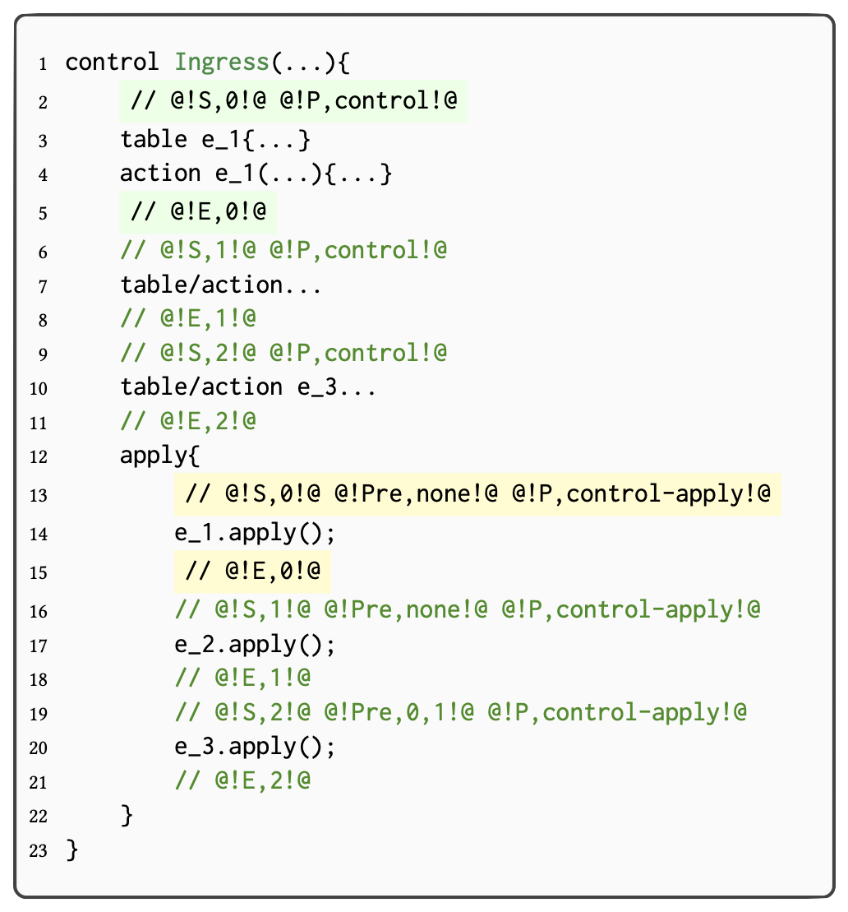
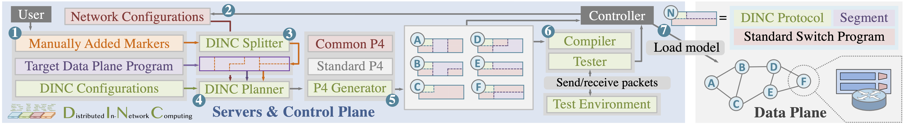

# <font color=#6B8E23>D</font>istributed <font color=#6B8E23>I</font>n-<font color=#6B8E23>N</font>etwork <font color=#6B8E23>C</font>omputing (DINC)

[](https://opensource.org/licenses/Apache-2.0)


## Introducing DINC
 DINC is a framework to provide automating distributed in-network computing service. 
 
## Setting up the DINC environment <span id = "environment"></span>

DINC requires python 3.10 or above, with the packages listed in [requirements\_Python3\_10\_8.txt](./src/configs/requirements_Python3_10_8.txt). To install the aforementioned packages, start your working environment and execute the following command:

```
pip3 install -r ./src/configs/requirements_Python3_10_8.txt
``` 

## Getting started with DINC

First, prepare a working environment as described in the previous section [Link](#environment). 

Run the following command to start DINC in manual configuration mode ```-m``` with target in-network computing program directory after ```-d```. Use help model with ```-h``` command to see additional options. 

```
python3 DINC.py -m -d <directory>
``` 

💡 A detailed getting started tutorial [Link: "Please click me!"](./src/help/Sample_Tutorial/DINC_Tutorial.md) (**Strongly Recommended**). 

## DINC Supports
DINC supports a wide range of modules mainly including modular Topologies, Architectures, and Usecases:

- DINC Supported Topologies [wiki](./src/help/DINC_Supports/DINC_Supported_Topologies.md) 
- DINC Supported Architectures [wiki](./src/help/DINC_Supports/DINC_Supported_Architectures.md) 
- DINC Supported Usecases [wiki](./src/help/DINC_Supports/DINC_Supported_Use_Cases.md) 

DINC also supports modular [Slicer](./src/slicing)s, [Solver](./src/solver)s, [Code Generator](./src/code_generator)s, [Test Controller](./src/test)s, etc.


## How to manually mark P4 grogram for DINC
The following figure gives a general outlook of how P4 programs are  sliced in the current P4 slicer module ([Manually](./src/slicing/Manually)). 
<!--There are also samples sliced programs under folder [Sample](./src/slicing/Sample)-->

 


## The DINC Framework


## DINC's Availability

DINC is currently under a peer-review process. **_The source code will be made available once the peer-reviewed version is published_**.

If you're interested in this work and find anything unclear, please feel free to contact me at ```changgang.zheng@eng.ox.ac.uk```. **_We are welcoming collaborations._** It can be exciting to collaborate, if you think in-network machine learning is helpful to your research or use case. If there are any potential interests, please feel free to contact my supervisor ```noa.zilberman@eng.ox.ac.uk``` and me ```changgang.zheng@eng.ox.ac.uk```.

## License

The files are licensed under Apache License: [LICENSE](./LICENSE). The text of the license can also be found in the LICENSE file.

## Citation

We are also excited to introduce several DINC related papers ([Planter](https://arxiv.org/pdf/2205.08824.pdf), [Planter poster](https://dl.acm.org/doi/10.1145/3472716.3472846), [IIsy](https://arxiv.org/pdf/2205.08243.pdf), [Linnet](https://changgang-zheng.github.io/Home-Page/papers/Linnet%20Limit%20Order%20Books%20Within%20Switches.pdf), and [P4Pir](https://changgang-zheng.github.io/Home-Page/papers/P4Pir%20In-Network%20Analysis%20for%20Smart%20IoT%20Gateways.pdf)): 

```
@article{zheng2022automating,
  title={Automating In-Network Machine Learning},
  author={Zheng, Changgang and Zang, Mingyuan and Hong, Xinpeng and Bensoussane, Riyad and Vargaftik, Shay and Ben-Itzhak, Yaniv and Zilberman, Noa},
  journal={arXiv preprint arXiv:2205.08824},
  year={2022}
}

@incollection{zheng2021planter,
  title={Planter: seeding trees within switches},
  author={Zheng, Changgang and Zilberman, Noa},
  booktitle={Proceedings of the SIGCOMM'21 Poster and Demo Sessions},
  pages={12--14},
  year={2021}
}

@article{zheng2022iisy,
  title={IIsy: Practical In-Network Classification},
  author={Zheng, Changgang and Xiong, Zhaoqi and Bui, Thanh T and Kaupmees, Siim and Bensoussane, Riyad and Bernabeu, Antoine and Vargaftik, Shay and Ben-Itzhak, Yaniv and Zilberman, Noa},
  journal={arXiv preprint arXiv:2205.08243},
  year={2022}
}

@incollection{hong2022linnet,
  title={Linnet: Limit Order Books Within Switches},
  author={Hong, Xinpeng and Zheng, Changgang and Zohren, Stefan and Zilberman, Noa},
  booktitle={Proceedings of the SIGCOMM'22 Poster and Demo Sessions},
  year={2022}
}

@incollection{zang2022p4pir,
  title={P4Pir: In-Network Analysis for Smart IoT Gateways},
  author={Zang, Mingyuan and Zheng, Changgang and Stoyanov, Radostin and Dittmann, Lars and Zilberman, Noa},
  booktitle={Proceedings of the SIGCOMM'22 Poster and Demo Sessions},
  year={2022}
}
```

Planter builds upon [IIsy](https://github.com/cucl-srg/IIsy) and is further inspired by [SwitchTree](https://github.com/ksingh25/SwitchTree), [Qin](https://github.com/vxxx03/IFIPNetworking20), and [Clustreams](https://dl.acm.org/doi/pdf/10.1145/3482898.3483356).
