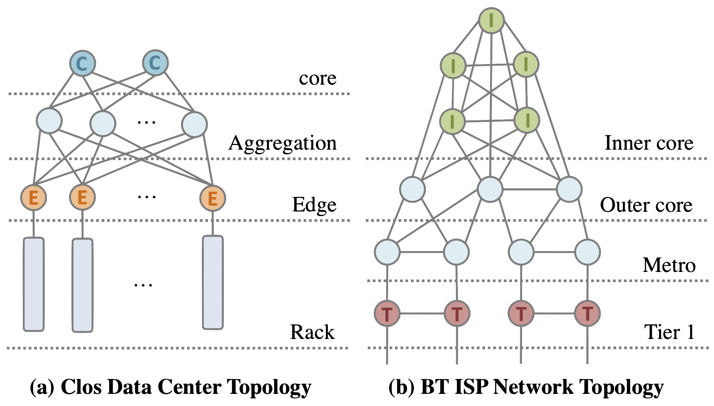

# DINC Supports


## A Guide to Evaluation Reproduction.

All figures (Figure 12-
17 and Table 3) can be generated by the Python files in ```./src/eva/*/*.py```, where the raw experiment data is hardcoded directly. All data can be generated by DINC, with detailed instructions available in ```./README.md```. A detailed explanation of the DINC's configuration for each experiment is provided below, aiding in the replication of the results used in the figures and tables.


###Important Configurations:
For most of unmentioned configurations, please use the default option. 

* **Topology**: Please use ```BT-ASP``` and ```Folded-Clos-ASP``` for evaluation. When slecting BT topology, please select ```False``` in _display plot_. When select Clos topology, apply switch number```3```, ```6```, and ```24``` in each layer.
* **Planner**: Please use ```ILP``` and ```Type_1```.
* **Input & Output Device List**: For the BT topology, please follows the guide from the CLI. For the Folded Clos topology, _all C_ means ```[0,1,2]``` and _all E_ meanse ```[9,10,...,32]```. For the case of _any C_ or _E_, random slect one from previous list repectively.
* **Result**: Choose ```True``` in _test ILP_ to display results.
* **Example Algorithms**: Example algorithms are provided under ```./src/sample/*/*.p4```.

<!---->
 
