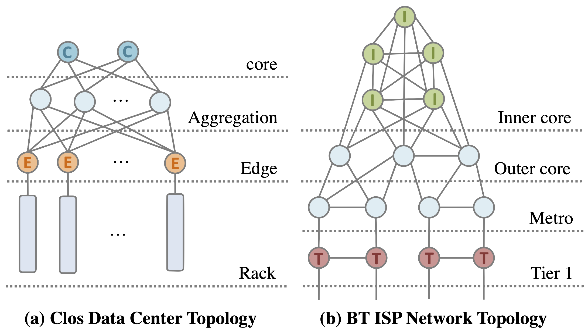

# DINC Supports

<aside>
💡 A guide to DINC supported network topologies and their variations.

</aside>

## Supported Network Topologies

<!--Each ML model can be mapped to a data plane in multiple ways. The three common ways are Direct Map (DM), Lookup Based (LB) and Encode Based (EB). In addition, there are multiple other ways, often a variation of the three, marked as Type_N. 

Mappings marked as EB, DM or LB are suitable only with the performance use case. In these cases, stage allocation is better with manual optimization (better than in the paper). -->

The recommended variation for each model is marked with 🔥.

**1. Fat Tree Topology** 

- **Fat-Tree [[Folder]](../../topologies/Fat-Tree):** This case using `nx.all_simple_paths()` funtion to find the paths.

We will mainly shows the piecture of Folded-Clos and BT ISP topology, as shown in the picture below:

**2. Folded Clos Topology**  

- **Folded-Clos-All:** All possible none loop paths with out duplication nodes. This case using `nx.all_simple_paths()` funtion to find the paths.
- **Folded-Clos [[Folder]](../../topologies/Folded-Clos) 🔥:** Only sigle direction from device-to-core/core-to-device and avioid valley free routing for device to device case. This case using `nx.all_simple_paths()` funtion to find the paths.
- **Folded-Clos-ASP** Same as Folded-Clos but using `nx.all_shortest_paths()` funtion to find the paths.

**3. BT Topology**  

- **BT [[Folder]](../../topologies/BT) 🔥:** This case using `nx.all_simple_paths()` funtion to find the paths.
- **BT-ASP** Same as BT but using `nx.all_shortest_paths()` funtion to find the paths.

We also shows a detailed aerial view of the BT ISP topology.

