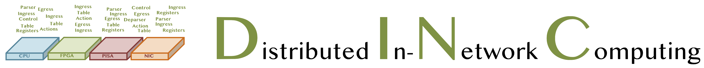

# DINC Supports

<aside>
💡 A guide to DINC supported use cases.

</aside>

## Supported use cases 
DINC currently support four use cases. Hot use cases are marked with 🔥.

**1. Standard Block 🔥** [Folder](../../use_cases/standard_block) - This use case is for functionality verification. In this case, the switching functionality will be simple ipv4 forwarding table.

**1. switch.p4** - This use case is for functionality verification. In this case, the distributed segmentations will coexist with an L2/L3 reference designed by Intel Tofino.

**1. RARE** - This use case is for functionality verification. In this case, the distributed segmentations will coexist with the RARE open-source router [Link](http://docs.freertr.org/).